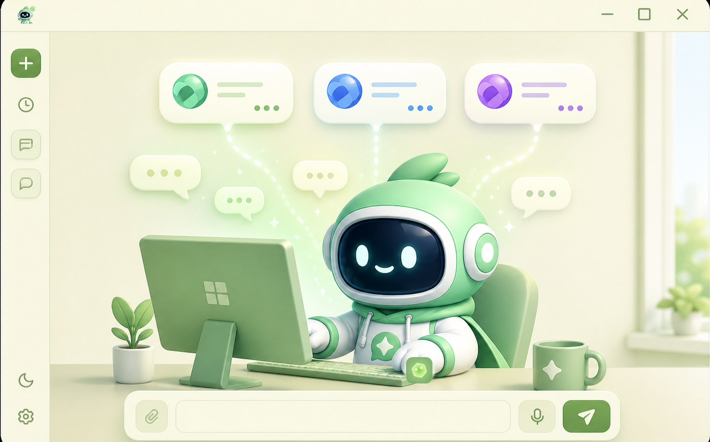
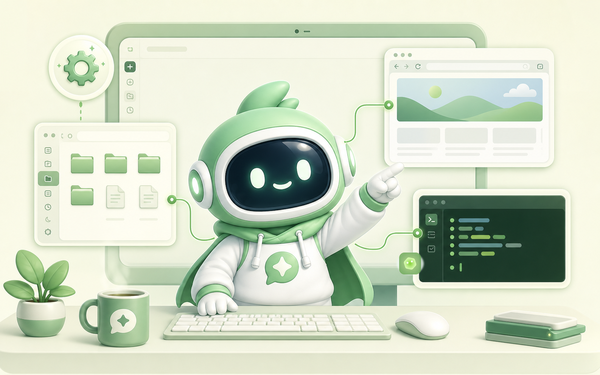
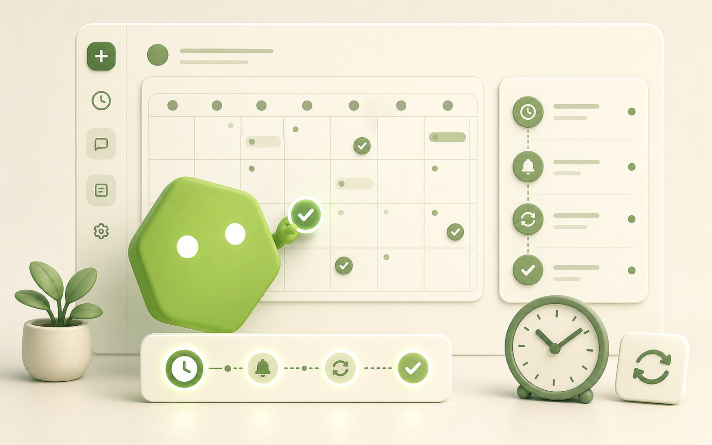
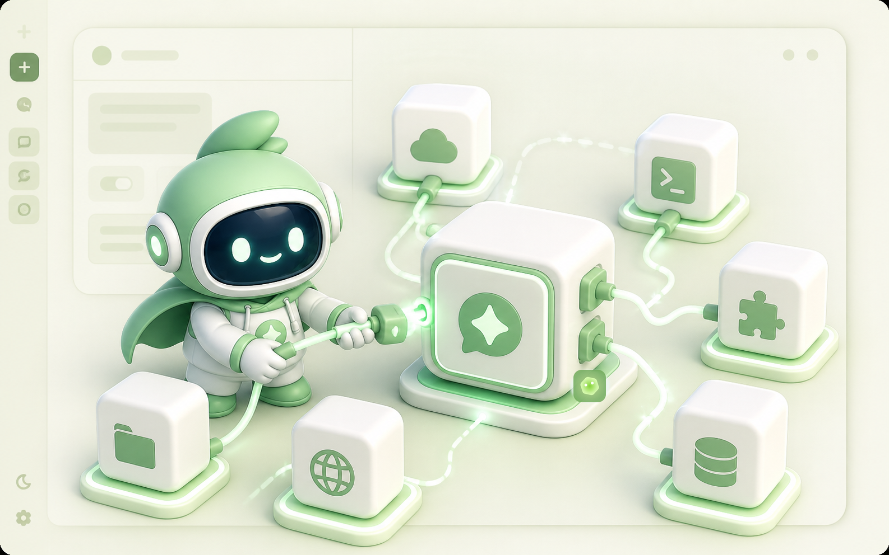
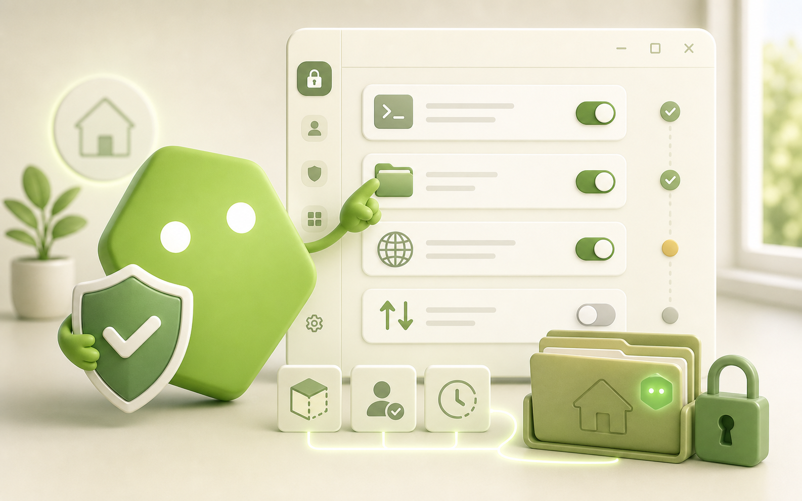

# Monaw

<p align="center">
  
</p>

**Monaw Agent is a local-first Windows desktop AI agent for people who want an assistant that can work inside their machine, not just answer questions.**

Monaw combines a calm chat interface with controlled access to local files, shell commands, browser automation, computer-use actions, memory, scheduled tasks, MCP servers, and an optional Telegram bridge. You bring your own model keys, choose the provider and permission profile, and keep runtime data under your local Monaw folder.

It is built for users who have outgrown basic chatbots but do not want a heavyweight agent setup that burns through context, hides what it is doing, or turns every task into a large token bill. Monaw focuses on practical desktop automation: give it a task, review tool access, and let it work with your Windows workspace under your control.

Monaw currently targets Windows. macOS has not been tested yet.

## Why Monaw

- **Desktop-first workflow.** Work with files, browser pages, local commands, app windows, and scheduled follow-ups from one agent UI.
- **Local control.** Runtime data, memory files, logs, browser artifacts, and the default workspace stay under your local Monaw folder.
- **Bring your own models.** Use OpenAI or Google Gemini through your own API keys.
- **Context discipline.** Memory, context tracking, and compression help keep useful knowledge available without blindly stuffing every conversation.
- **Tool permissions.** Choose sandbox, approval, and access settings before the agent performs higher-impact actions.
- **Windows-friendly setup.** The one-click setup prepares Python, Node, backend packages, and frontend packages for normal Windows users.

## What Monaw Can Do

<table>
  <tr>
    <td width="50%" valign="top">
      
      <br />
      <strong>Chat With Your Preferred Models</strong>
      <br />
      Use OpenAI or Google Gemini through your own API keys, while keeping conversations in one local desktop workspace.
    </td>
    <td width="50%" valign="top">
      
      <br />
      <strong>Work Inside Your Windows Desktop</strong>
      <br />
      Ask Monaw to inspect files, run local commands, automate browser flows, and coordinate computer-use actions with visible tool access.
    </td>
  </tr>
  <tr>
    <td width="50%" valign="top">
      
      <br />
      <strong>Remember Useful Context</strong>
      <br />
      Store long-term memory locally and use context tracking plus compression so the agent can stay helpful without wasting tokens.
    </td>
    <td width="50%" valign="top">
      
      <br />
      <strong>Schedule Follow-Up Work</strong>
      <br />
      Run scheduled tasks with history for reminders, recurring checks, delayed follow-ups, and automation that should happen later.
    </td>
  </tr>
  <tr>
    <td width="50%" valign="top">
      
      <br />
      <strong>Connect Tools Through MCP</strong>
      <br />
      Add MCP servers from Settings, use browser automation through <code>browser-use</code>, and optionally connect a Telegram bot bridge.
    </td>
    <td width="50%" valign="top">
      
      <br />
      <strong>Control What The Agent Can Do</strong>
      <br />
      Choose permissions, approvals, access grants, and sandbox settings before Monaw performs higher-impact actions.
    </td>
  </tr>
</table>

## Requirements

- Windows 10 or 11. macOS is not tested yet.
- Git.
- Node.js 18+ and npm. The one-click setup can install this for you.
- `uv`. The one-click setup can install it for you, and `uv` installs the pinned Python 3.11 runtime automatically.
- Optional: Docker Desktop for stronger shell-command sandboxing.

## Install

Clone the repo:

```powershell
git clone https://github.com/kailiang0120/monaw.git
cd monaw
```

### Option A: One-Click Windows Setup

For normal Windows users, double-click [setup.bat](setup.bat):

```text
setup.bat
```

The setup launcher will:

- Install `uv` with Windows Package Manager if it is missing.
- Install Node.js LTS with Windows Package Manager if Node/npm is missing.
- Install the Python version pinned in `backend\.python-version`.
- Create `backend\.venv` and sync the dependencies locked in `backend\uv.lock`.
- Run `npm ci` in `frontend`.

When setup finishes, double-click [start.bat](start.bat):

```text
start.bat
```

If setup fails, check:

```text
%USERPROFILE%\.monaw\runtime\setup\setup.log
```

### Option B: Manual Developer Setup

Install `uv`, then sync the locked backend environment:

```powershell
winget install --id=astral-sh.uv -e
cd backend
uv sync --locked
cd ..
```

Install the frontend packages:

```powershell
cd frontend
npm ci
cd ..
```

Start Monaw:

```powershell
.\start.bat
```

## First-Run Setup

Open Settings in Monaw Agent and configure only the services you use:

- OpenAI API key. Recommended.
- Google API key, if using Gemini.
- Tavily API key, if using web search tools.
- Telegram bot token and allowlist, if using Telegram.
- Model provider, model, and reasoning effort.
- Permission profile and access grants.
- Sandbox mode.
- Browser automation mode.
- MCP servers.
- Memory settings.

Normal desktop use does not require editing `.env`. The Settings screen saves runtime configuration locally.

## Daily Use

Start the app from the repo root:

```powershell
.\start.bat
```

The launcher starts the desktop app and exits after startup succeeds.

`uv` selects the pinned Python runtime and keeps `backend\.venv` in sync. If
`uv` is installed at a custom path, set `AGENT_UV_PATH` before launching:

```powershell
$env:AGENT_UV_PATH = "C:\path\to\uv.exe"
.\start.bat
```

## Local Data

Runtime app data is local. Monaw keeps user-visible data under:

```text
%USERPROFILE%\.monaw\
```

Main folders:

```text
%USERPROFILE%\.monaw\runtime\        settings, database, logs, Electron store
%USERPROFILE%\.monaw\workspace\      default agent working directory
%USERPROFILE%\.monaw\browser\        managed browser profile, downloads, screenshots, traces
%USERPROFILE%\.monaw\memory\         long-term memory markdown files
```

Settings, config, logs, browser downloads, screenshots, managed profiles, traces, memory, and the default agent workspace all stay under this folder.

You can change the main data folder with `MONAW_HOME` or `AGENT_HOME`, the runtime folder with `AGENT_RUNTIME_DIR`, the default agent workspace with `AGENT_WORKSPACE_DIR`, and the memory folder with `AGENT_MEMORY_DIR`.

## Feature Docs

Memory is configured in Settings -> Memory. Memory files are local markdown files and can be edited from the app. See [docs/memory.md](docs/memory.md).

Browser automation is configured in Settings -> Browser. See [docs/browser-automation.md](docs/browser-automation.md).

MCP servers are configured in Settings -> MCP. See [docs/mcp.md](docs/mcp.md).

Scheduled tasks are configured in the app when scheduling is enabled. See [docs/scheduling.md](docs/scheduling.md).

Telegram is optional. Keep the bot token private and keep the allowlist narrow. See [docs/telegram.md](docs/telegram.md).

Permissions, approvals, access grants, and sandbox settings are configured in Settings. See [docs/permissions.md](docs/permissions.md) and [docs/sandboxing.md](docs/sandboxing.md).

The backend API is a privileged local control plane. The desktop application
authenticates every `/api` request with a short-lived session and binds the
backend to loopback by default. Do not expose the backend through port
forwarding, reverse proxies, tunnels, permissive firewall rules, or non-loopback
binds. See [docs/operations.md](docs/operations.md).

Provider keys and the Telegram bot token are encrypted through Electron's
OS-backed `safeStorage`. Saved credential values are write-only from the
renderer: the UI can see whether a value exists, but cannot read it back.

The generated endpoint reference is [docs/api.md](docs/api.md).

## Troubleshooting

If `start.bat` fails before the app opens, check:

```text
%USERPROFILE%\.monaw\runtime\launcher\vite.log
%USERPROFILE%\.monaw\runtime\launcher\electron.log
```

If the app opens but cannot connect to the backend, check:

```text
%USERPROFILE%\.monaw\runtime\
```

If backend imports fail, restore the locked backend environment:

```powershell
cd backend
uv sync --locked
```

If frontend startup fails, reinstall frontend packages:

```powershell
cd frontend
npm ci
```

If Vite reports port `5275` is already in use, stop the existing Vite process or reuse it intentionally.

## Developer Docs

Developer setup, architecture, module map, testing, and packaging notes are in [docs/development.md](docs/development.md).

## Repository Status

This public repository is currently intended for cloning, local use, and code review. External contributions are not being accepted yet; issues, pull requests, and Discussions may stay disabled until the project is ready for community maintenance.

## License

Apache License 2.0. See [LICENSE](LICENSE).
