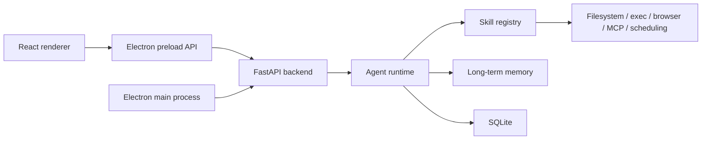

# Monaw Development

This document is for contributors and maintainers. The root README is for end users.

## Tech Stack

- Frontend: Electron, React, Vite, TypeScript, Tailwind CSS.
- Backend: FastAPI, Uvicorn, Pydantic.
- Python environment and dependencies: `uv`, `pyproject.toml`, and `uv.lock`.
- LLM providers: OpenAI SDK, Google GenAI SDK.
- Storage: SQLite plus local markdown memory files.
- Automation: `browser-use`, MCP, and Windows desktop automation packages.

## Development Commands

Run the full dev app from the frontend folder:

```powershell
cd frontend
npm run dev
```

This starts Vite and Electron. Electron starts the backend.

Run only Vite:

```powershell
cd frontend
npm run dev:vite
```

Run only Electron:

```powershell
cd frontend
npm run dev:electron
```

Run only the backend:

```powershell
cd backend
$env:MONAW_CONTROL_SECRET = 'replace-with-at-least-32-random-characters'
uv run --locked uvicorn app.main:app --host 127.0.0.1 --port 8435 --reload
```

Health check:

```powershell
Invoke-WebRequest -UseBasicParsing http://127.0.0.1:8435/health
```

All `/api` endpoints require a short-lived bearer session issued by Electron.
The `/health` endpoint is the only unauthenticated runtime endpoint. Browser-only
development must explicitly opt into a development token:

```powershell
$env:MONAW_CONTROL_SECRET = 'replace-with-at-least-32-random-characters'
$env:MONAW_ALLOW_DEVELOPMENT_TOKEN = '1'
$env:VITE_MONAW_CONTROL_TOKEN = $env:MONAW_CONTROL_SECRET
```

Do not expose the backend through port forwarding, a reverse proxy, a tunnel, or
a non-loopback bind. Electron rejects non-loopback backend hosts unless
`MONAW_ALLOW_UNSAFE_BACKEND_HOST=1` is deliberately set.

Operational security, incident response, backup, restore, retention, and
complete-data-deletion guidance lives in [operations.md](operations.md). The
generated route table lives in [api.md](api.md) and is checked by tests.

## Credential Storage

Provider API keys and the Telegram bot token are encrypted in Electron main
using the operating system's credential encryption through `safeStorage`.
Renderer JavaScript can set, delete, apply, and read boolean status for a
credential, but it cannot retrieve a stored plaintext value.

On first launch after upgrading, Electron migrates legacy plaintext values from
the existing Electron store. It encrypts and verifies each value before removing
the legacy plaintext. If OS encryption is unavailable or verification fails,
credential operations fail and the original value is retained.

Browser-only development does not have OS-backed Electron storage. Credentials
entered in that mode are sent directly to the authenticated backend for the
current process and should be treated as development-only configuration.

Frontend npm commands must run from `frontend`, not the repo root.

Backend dependency commands must run from `backend`. Use `uv add <package>` to
add a runtime dependency, `uv add --dev <package>` to add a development
dependency, and commit both `pyproject.toml` and `uv.lock`. Use
`uv sync --locked` when reproducing a committed environment.

## Related Module Docs

- [Memory](memory.md)
- [MCP](mcp.md)
- [Browser automation](browser-automation.md)
- [Scheduling](scheduling.md)
- [Telegram](telegram.md)
- [Permissions](permissions.md)
- [Sandboxing](sandboxing.md)
- [Operations](operations.md)
- [API route reference](api.md)

## Runtime Layout

Runtime data is stored under:

```text
%USERPROFILE%\.monaw\runtime\
```

Important files:

```text
%USERPROFILE%\.monaw\runtime\agent.db          SQLite conversations, runs, and app state
%USERPROFILE%\.monaw\runtime\settings.json     Runtime settings saved by the app
%USERPROFILE%\.monaw\runtime\backend.log       Backend process log
%USERPROFILE%\.monaw\runtime\launcher\         Launcher logs
```

The user's Monaw home folder is:

```text
%USERPROFILE%\.monaw\
```

Runtime layout:

```text
%USERPROFILE%\.monaw\runtime\        settings.json, agent.db, backend.log, Electron store
%USERPROFILE%\.monaw\workspace\      default workdir for agent shell commands
%USERPROFILE%\.monaw\browser\        managed browser data and artifacts
%USERPROFILE%\.monaw\memory\         long-term memory markdown files
```

Override the main folder with `MONAW_HOME` or `AGENT_HOME`, runtime with `AGENT_RUNTIME_DIR`, workspace with `AGENT_WORKSPACE_DIR`, and memory with `AGENT_MEMORY_DIR`.

## Architecture



## Module Guide

```text
backend/app/main.py                    FastAPI app, CORS, health check, scheduler and Telegram startup
backend/app/config.py                  Environment-backed defaults used before runtime settings load
backend/app/api/routes/                HTTP API routes for chat, settings, memory, files, uploads, sandbox, diagnostics, approvals, access grants, conversations, and scheduled tasks
backend/app/agent/runtime.py           Runtime assembly for settings, LLM client, memory, tools, MCP, and run execution
backend/app/agent/turn_loop.py         Main agent turn loop and tool-call flow
backend/app/agent/llm_client.py        OpenAI and Gemini client abstraction
backend/app/agent/settings_store.py    Local runtime settings persistence
backend/app/agent/long_term_memory.py  Sectioned markdown long-term memory storage
backend/app/agent/scheduler.py         Scheduled task service and run orchestration
backend/app/agent/sandbox/             Exec sandbox policy, backend selection, sessions, and path controls
backend/app/agent/harness/             Tool protocol, execution wrapper, and policy checks
backend/app/agent/observability/       Trajectory logging
backend/app/agent/security/            Prompt-injection detection helpers
backend/app/skills/                    Runtime skills exposed to the agent
backend/app/integrations/telegram/     Optional Telegram bridge
frontend/electron/                     Electron main and preload processes
frontend/src/                          React renderer, settings UI, chat UI, scheduling UI, API clients, and tests
scripts/start-windows.ps1              Windows dev launcher used by start.bat
docs/browser-automation.md             Browser automation behavior and troubleshooting
docs/mcp.md                            MCP server setup, lifecycle, and reflected tools
docs/memory.md                         Long-term memory storage and APIs
docs/permissions.md                    Permissions, approvals, and access grants
docs/sandboxing.md                     Sandbox behavior and troubleshooting
docs/scheduling.md                     Scheduled task lifecycle and APIs
docs/telegram.md                       Telegram bridge setup and operations
```

Current built-in skills:

```text
browser_use       Managed browser automation
computer_use      Windows desktop observation and control helpers
core              Basic runtime/system controls
exec              Shell command execution through the sandbox layer
filesystem        File read/write/search helpers
mcp_bridge        MCP server tool bridge
memory            Long-term memory tools
scheduling        Scheduled task tools
```

## Models

The model dropdown uses:

```text
GET /api/settings/model-options
```

The local catalog is defined in `backend\app\agent\llm_constants.py`.

Default backend settings:

```text
provider: openai
model: gpt-5.6-luna
reasoning_effort: medium
```

Images and screenshots are sent to the configured chat model, which reads them
natively. There is no separate vision model.

Current curated chat model groups:

```text
OpenAI:   gpt-5.6-luna
Google:   gemini-3.1-pro-preview, gemini-3.1-flash-lite, gemini-3.1-flash-lite-preview, gemini-3-flash-preview
```

## Memory Internals

Durable memory is stored locally as sectioned markdown. Inside the memory root, long-term memory is stored by category:

```text
long-term\preference.md
long-term\behavior.md
long-term\fact.md
long-term\workflow.md
long-term\project.md
long-term\reflection.md
```

Each section is editable through the Settings UI and memory API. The legacy `style` category is normalized into `preference`.

## Browser Automation

Browser settings and diagnostics live in Settings -> Browser.

For Chrome DevTools MCP workflows, use one of the MCP templates in Settings -> MCP, or start Chrome manually with remote debugging.

## MCP

MCP servers are configured in Settings -> MCP. The app supports filesystem, Chrome DevTools, and custom stdio or streamable HTTP server entries.

Diagnostics in the same panel show server connection state, reflected tools, process state, and startup errors.

## Sandbox And Permissions

Approvals and access grants run before tool execution. Shell execution then routes through the sandbox layer.

Sandbox modes include:

```text
off (shell disabled)
auto (strong isolation or explicit host approval)
enforce (strong isolation required)
host (unsandboxed, approval required)
docker
local_restricted (advisory host runner, approval required)
```

See `docs\sandboxing.md` for backend behavior and limitations.

## Testing

Run the complete local verification workflow from the repository root:

```powershell
.\scripts\verify.ps1
```

Backend tests are divided into independent groups:

```powershell
.\scripts\test-backend.ps1 -Group api
.\scripts\test-backend.ps1 -Group runtime
.\scripts\test-backend.ps1 -Group policy
.\scripts\test-backend.ps1 -Group sandbox
.\scripts\test-backend.ps1 -Group skills
.\scripts\test-backend.ps1 -Group memory
.\scripts\test-backend.ps1 -Group integrations
```

Use `-Group all` to run the complete backend suite. Each individual test has a
120-second timeout, and the wrapper applies a 15-minute timeout to the suite.
New backend test files must be assigned to exactly one group in
`backend/conftest.py`.

Frontend verification:

```powershell
cd frontend
npm run verify
```

This runs Vitest, TypeScript type checking, and the renderer production build.

Capture repeatable test and bundle baselines:

```powershell
.\scripts\measure-baseline.ps1
```

Baseline JSON is written under `.artifacts/baselines/` and is intentionally not
committed because timings and paths are machine-specific. Startup time, idle API
request rate, and representative database growth remain explicit manual fields
until provider-independent application harnesses are available.

GitHub Actions runs each backend group as a separate Windows job and runs the
frontend verification workflow on every push and pull request.
